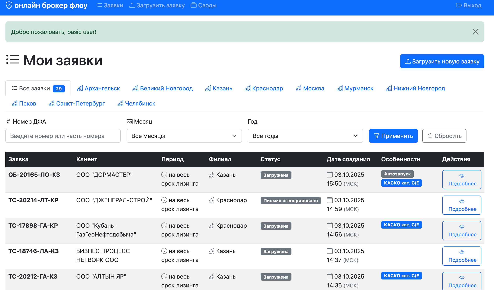

# Руководство пользователя
## Система управления страховыми заявками Он-лайн брокер ФЛОУ

**Версия:** 1.0  
**Дата:** 03 октября 2025 г.  
**Автор:** Grigorii Grachev

---

## О документе

Это подробное руководство по работе с системой управления страховыми заявками. Документ предназначен для сотрудников компании Он-лайн брокер, которые работают с обработкой страховых заявок на лизинговое имущество.

### Для кого это руководство

Руководство предназначено для:
- Новых пользователей, которые только начинают работу с системой
- Опытных пользователей, которым нужна справочная информация
- Администраторов системы

Предполагается базовое умение работать с компьютером и веб-браузером. Специальных технических знаний не требуется.

### Как пользоваться руководством

**Структура документа:**
- Документ организован по принципу "от простого к сложному"
- Начните с раздела "Введение" для понимания основ
- Используйте раздел "Начало работы" для первого входа в систему
- Обращайтесь к разделу "Основные функции" для пошаговых инструкций
- Используйте "Справочную информацию" для уточнения терминов и понятий
- Раздел "Решение проблем" поможет при возникновении трудностей


**Обозначения в документе:**

💡 **Совет** - полезная рекомендация для эффективной работы

⚠️ **Важно** - критическая информация, которую необходимо учитывать

ℹ️ **Примечание** - дополнительная информация для лучшего понимания

✅ **Пример** - практический пример использования функции

---

## Оглавление

1. [Введение](#введение)
   - [О системе](#о-системе)
   - [Для кого это руководство](#для-кого-это-руководство)
   - [Как пользоваться руководством](#как-пользоваться-руководством)

2. [Начало работы](#начало-работы)
   - [Вход в систему](#вход-в-систему)
   - [Обзор интерфейса](#обзор-интерфейса)

3. [Основные функции](#основные-функции)
   - [Загрузка заявок](#загрузка-заявок)
   - [Просмотр списка заявок](#просмотр-списка-заявок)
   - [Работа с фильтрами](#работа-с-фильтрами)
   - [Детальный просмотр заявки](#детальный-просмотр-заявки)
   - [Редактирование заявки](#редактирование-заявки)
   - [Генерация писем](#генерация-писем)

4. [Справочная информация](#справочная-информация)
   - [Типы страхования](#типы-страхования)
   - [Дополнительные параметры](#дополнительные-параметры)
   - [Работа с датами](#работа-с-датами)
   - [Статусы заявок](#статусы-заявок)

5. [Решение проблем](#решение-проблем)
   - [Часто задаваемые вопросы](#часто-задаваемые-вопросы)
   - [Типичные ошибки](#типичные-ошибки)
   - [Техническая поддержка](#техническая-поддержка)

---

## 1. Введение

### О системе

**Система управления страховыми заявками** - это веб-приложение, разработанное для автоматизации процесса обработки запросов на страхование лизингового имущества. Система помогает сотрудникам компании эффективно работать с заявками от клиентов, генерировать запросы для страховых компаний и отслеживать статус каждой заявки.

#### Основные возможности системы

Система предоставляет следующие возможности:

- **Автоматическая загрузка данных** - загружайте Excel файлы с заявками, и система автоматически извлечет все необходимые данные (номер ДФА, информацию о клиенте, параметры страхования и т.д.)

- **Централизованное хранение заявок** - все заявки хранятся в одном месте с удобным доступом и возможностью быстрого поиска

- **Умная фильтрация и поиск** - находите нужные заявки по филиалу, дате создания или номеру ДФА за считанные секунды

- **Автоматическая генерация писем** - система создает письма для страховых компаний на основе данных заявки, используя готовые шаблоны

- **Отслеживание статусов** - следите за прохождением каждой заявки через все этапы обработки

- **Работа с разными типами страхования** - поддержка КАСКО, страхования спецтехники, имущества и других видов страхования

- **Учет особенностей** - система автоматически определяет и учитывает дополнительные параметры (франшиза, рассрочка, автозапуск, КАСКО категории C/E)

#### Преимущества использования

**Экономия времени:** Автоматическое извлечение данных из Excel и генерация писем экономят до 70% времени на обработку каждой заявки.

**Снижение ошибок:** Автоматизация минимизирует риск ошибок при переносе данных и формировании запросов.

**Прозрачность процесса:** Все заявки и их статусы видны в одном месте, что упрощает контроль и планирование работы.

**Удобство работы:** Интуитивный интерфейс не требует специального обучения - начать работу можно сразу после первого входа.

### Для кого это руководство

Это руководство предназначено для всех сотрудников компании, которые работают с обработкой страховых заявок на лизинговое имущество.

#### Целевая аудитория

**Новые пользователи** - сотрудники, которые только начинают работу с системой. Руководство поможет вам:
- Понять основные концепции и возможности системы
- Выполнить первый вход и освоить интерфейс
- Научиться выполнять базовые операции
- Избежать типичных ошибок начинающих

**Опытные пользователи** - сотрудники, уже работающие с системой. Руководство служит:
- Справочником по функциям системы
- Источником советов по эффективной работе
- Руководством по решению нестандартных ситуаций

#### Предполагаемый уровень подготовки

Для работы с системой вам потребуется:

✅ **Базовые навыки работы с компьютером:**
- Умение пользоваться веб-браузером
- Навыки работы с клавиатурой и мышью
- Понимание основных понятий (файл, папка, ссылка)

✅ **Базовые знания Microsoft Excel:**
- Умение открывать и просматривать Excel файлы
- Понимание структуры таблиц (строки, столбцы, ячейки)

✅ **Знание предметной области:**
- Понимание основ страхования (желательно)
- Знание терминологии лизинга (желательно)

ℹ️ **Примечание:** Специальных технических знаний не требуется. Все термины и понятия объясняются в руководстве. Если вы встретите незнакомый термин, обратитесь к разделу "Справочная информация".

### Как пользоваться руководством

Это руководство организовано таким образом, чтобы вы могли быстро найти нужную информацию независимо от вашего уровня подготовки.

#### Структура документа

Документ построен по принципу **"от простого к сложному"** и состоит из следующих разделов:

**1. Введение** (текущий раздел)
- Общее представление о системе
- Для кого предназначено руководство
- Как ориентироваться в документе

**2. Начало работы**
- Первый вход в систему
- Обзор интерфейса и основных элементов
- Базовая навигация

💡 **Совет:** Если вы новый пользователь, начните с этого раздела

**3. Основные функции**
- Пошаговые инструкции по всем основным операциям
- Загрузка заявок, работа со списком, фильтрация
- Редактирование заявок и генерация писем

💡 **Совет:** Это основной рабочий раздел - обращайтесь к нему при выполнении повседневных задач

**4. Справочная информация**
- Подробное описание типов страхования
- Объяснение дополнительных параметров
- Информация о датах и статусах

💡 **Совет:** Используйте этот раздел для уточнения терминов и понятий

**5. Решение проблем**
- Часто задаваемые вопросы (FAQ)
- Типичные ошибки и способы их устранения

💡 **Совет:** Обращайтесь к этому разделу при возникновении трудностей


#### Навигация по документу

**Оглавление** в начале документа содержит ссылки на все разделы. Кликните по названию раздела, чтобы перейти к нему.

**Ссылки в тексте** выделены синим цветом и ведут к связанным разделам или дополнительной информации.

**Глоссарий** в конце документа содержит определения всех специальных терминов. Термины в тексте часто содержат ссылки на глоссарий.

**Поиск по документу:** Используйте функцию поиска вашего браузера (обычно Ctrl+F или Cmd+F) для быстрого нахождения нужной информации.


---

## 2. Начало работы

Этот раздел поможет вам сделать первые шаги в системе: войти в свою учетную запись и познакомиться с интерфейсом.

### Вход в систему

Для начала работы с системой вам необходимо войти в свою учетную запись.

#### Пошаговая инструкция по входу

**Шаг 1: Откройте страницу входа**

Откройте веб-браузер (рекомендуется Google Chrome, Mozilla Firefox, Safari или Microsoft Edge) и перейдите по адресу системы, который вам предоставил администратор.


**Шаг 2: Введите логин**

В поле "Логин" введите ваше имя пользователя:
- Логин предоставляется администратором системы при создании учетной записи
- Обычно это ваша фамилия латинскими буквами
- Логин чувствителен к регистру (различает большие и маленькие буквы)
- Минимальная длина логина - 3 символа

✅ **Пример:** `ivanov`, `petrov`, `sidorova`

**Шаг 3: Введите пароль**

В поле "Пароль" введите ваш пароль:
- Пароль также предоставляется администратором при создании учетной записи
- Пароль чувствителен к регистру
- Убедитесь, что клавиша CAPS LOCK выключена
- Минимальная длина пароля - 6 символов
- При вводе пароль скрыт символами (точками или звездочками) для безопасности

⚠️ **Важно:** Пароль является конфиденциальной информацией. Не сообщайте его другим людям и не записывайте в общедоступных местах.

**Шаг 4: Нажмите кнопку "Войти"**

После ввода логина и пароля нажмите кнопку "Войти" или просто нажмите клавишу Enter на клавиатуре.

**Шаг 5: Дождитесь загрузки**

Система проверит ваши учетные данные и перенаправит вас на главную страницу. Это обычно занимает 1-2 секунды.

#### Описание полей формы входа

Форма входа содержит следующие элементы:

**Заголовок "он-лайн брокер флоу"** - название системы

**Подзаголовок "Войдите в свою учетную запись"** - краткое описание действия

**Поле "Логин"** (с иконкой пользователя):
- Текстовое поле для ввода имени пользователя
- Обязательное для заполнения
- Автоматически получает фокус при открытии страницы

**Поле "Пароль"** (с иконкой замка):
- Защищенное текстовое поле для ввода пароля
- Обязательное для заполнения
- Символы скрыты для безопасности

**Кнопка "Войти"** (с иконкой входа):
- Отправляет данные для проверки
- Становится неактивной во время проверки учетных данных
- Показывает индикатор загрузки при обработке


#### Решение проблем со входом

**Проблема: "Неверный логин или пароль"**

Если система выдает сообщение об ошибке "Неверный логин или пароль", проверьте следующее:

1. **Правильность ввода логина и пароля**
   - Убедитесь, что вы вводите правильные данные
   - Проверьте, нет ли лишних пробелов в начале или конце
   - Убедитесь, что используете правильную раскладку клавиатуры (английскую)

2. **Регистр символов**
   - Проверьте, не включен ли CAPS LOCK
   - Логин и пароль чувствительны к регистру
   - "Ivanov" и "ivanov" - это разные логины

3. **Копирование из других источников**
   - Если вы копируете пароль из email или документа, убедитесь, что не скопировали лишние символы
   - Попробуйте ввести пароль вручную

✅ **Пример ошибки:** Вы вводите пароль "Password123", но правильный пароль "password123" (с маленькой буквы)


### Обзор интерфейса

После успешного входа в систему вы попадаете на главную страницу со списком заявок. Давайте познакомимся с основными элементами интерфейса.



#### Главная страница

Главная страница - это центральное место работы с системой. Здесь отображается список всех ваших заявок и предоставляется доступ ко всем основным функциям.

**Что вы увидите на главной странице:**

- Список всех заявок в виде таблицы
- Панель фильтров для поиска нужных заявок
- Кнопку для загрузки новых заявок
- Информацию о вашей учетной записи
- Навигационные элементы

#### Основные элементы интерфейса

Интерфейс системы состоит из нескольких ключевых областей:

**1. Верхняя панель (шапка сайта)**

Расположена в самом верху страницы и содержит:

- **Название системы** (слева) - "он-лайн брокер флоу"
  - Кликабельный логотип, который всегда возвращает на главную страницу
  - Используйте его для быстрого возврата к списку заявок


**2. Панель действий**

Расположена под верхней панелью и содержит основные инструменты для работы:

- **Кнопка "Загрузить новую заявку"**
  - Большая заметная кнопка (обычно синего или зеленого цвета)
  - Открывает форму для загрузки Excel файла с заявкой
  - Это основной способ добавления новых заявок в систему

- **Вкладки филиалов**
  - Горизонтальный ряд вкладок с названиями филиалов
  - Позволяет быстро фильтровать заявки по филиалу
  - Вкладка "Все заявки" показывает заявки всех филиалов
  - Активная вкладка выделена цветом

- **Фильтры по дате**
  - Выпадающие списки для выбора месяца и года
  - Позволяют отфильтровать заявки по дате создания
  - Кнопка "Применить" для активации фильтров
  - Кнопка "Сбросить" для очистки всех фильтров

- **Поиск по номеру ДФА**
  - Текстовое поле для ввода номера заявки
  - Поддерживает поиск по частичному совпадению
  - Кнопка "Применить" для запуска поиска

💡 **Совет:** Фильтры можно комбинировать - например, выбрать филиал и месяц одновременно.

**3. Список заявок (основная рабочая область)**

Центральная часть страницы, содержащая таблицу со всеми заявками:

**Колонки таблицы:**

- **Заявка** - номер ДФА или внутренний ID заявки
- **Клиент** - название организации-клиента
- **Период** - срок страхования
- **Филиал** - филиал, приславший заявку
- **Статус** - текущий статус обработки заявки (с цветовой индикацией)
- **Дата создания** - когда заявка была загружена в систему
- **Особенности** - значки дополнительных параметров (франшиза, рассрочка, автозапуск, C/E)
- **Действия** - кнопка "Подробнее" для просмотра деталей заявки


#### Назначение каждого элемента меню

Давайте подробнее рассмотрим назначение основных элементов:

**Кнопка "Загрузить новую заявку"**
- **Назначение:** Добавление новой заявки в систему
- **Когда использовать:** Когда вы получили от клиента Excel файл с заявкой на страхование
- **Что происходит:** Открывается форма загрузки, где вы выбираете файл на вашем компьютере
- **Результат:** Система извлекает данные из файла и создает новую заявку

**Вкладки филиалов**
- **Назначение:** Быстрая фильтрация заявок по филиалу
- **Когда использовать:** Когда вы хотите видеть только заявки определенного филиала
- **Доступные филиалы:**
  - Все заявки (показывает все без фильтрации)
  - Казань
  - Нижний Новгород
  - Краснодар
  - Санкт-Петербург
  - Мурманск
  - Псков
  - Челябинск
  - Москва
  - Великий Новгород
  - Архангельск

**Фильтры по дате**
- **Назначение:** Поиск заявок, созданных в определенный период
- **Когда использовать:** Когда вам нужны заявки за конкретный месяц или год
- **Как работает:** Выберите месяц и/или год, нажмите "Применить"
- **Примеры использования:**
  - Просмотр всех заявок за январь 2025 года
  - Просмотр всех заявок за 2024 год (без указания месяца)
  - Просмотр заявок за март любого года (без указания года)

**Поиск по номеру ДФА**
- **Назначение:** Быстрый поиск конкретной заявки по её номеру
- **Когда использовать:** Когда вы знаете номер заявки и хотите быстро её найти
- **Как работает:** Введите полный номер или его часть, нажмите "Применить"
- **Особенности:** Поиск не чувствителен к регистру и находит частичные совпадения

✅ **Пример:** Поиск "20212" найдет заявки "ТС-20212-ГА-КЗ", "СМ-20212-ЛТ-МН" и т.д.

**Кнопка "Подробнее"**
- **Назначение:** Открытие детальной информации о заявке
- **Когда использовать:** Когда нужно просмотреть все данные заявки, отредактировать её или сгенерировать письмо
- **Что происходит:** Открывается страница с полной информацией о заявке
- **Доступные действия:** Просмотр, редактирование, генерация письма, скачивание файлов


---

## 3. Основные функции

Этот раздел содержит пошаговые инструкции по выполнению всех основных операций в системе. Используйте его как справочник при повседневной работе.

### Загрузка заявок

Загрузка заявок - это первый и основной шаг в работе с системой. Система автоматически извлекает данные из Excel файлов, что позволяет использовать загружаемые данные на следующих этапах разрабатываемой системы.

#### Требования к Excel файлам

Система поддерживает загрузку файлов в следующих форматах:

**Поддерживаемые форматы:**
- **.xls** - формат Excel 97-2003 (старый формат)
- **.xlsx** - формат Excel 2007 и новее (современный формат)
- **.xltx** - формат шаблона Excel

**Ограничения:**
- Максимальный размер файла: **10 МБ**
- Файл должен быть в исправном состоянии (не поврежден)
- Рекомендуется использовать стандартный шаблон заявки компании

⚠️ **Важно:** Файлы других форматов (.doc, .pdf, .txt и т.д.) не поддерживаются. Если вы получили заявку в другом формате, попросите менеджера предоставить её в формате Excel.


#### Пошаговая инструкция по загрузке

**Шаг 1: Откройте форму загрузки**

На главной странице системы найдите и нажмите кнопку **"Загрузить новую заявку"**. Эта кнопка обычно расположена в верхней части страницы, под панелью навигации, и выделена ярким цветом (синим или зеленым).

**Шаг 2: Откроется форма загрузки**

После нажатия кнопки откроется страница с формой загрузки файла. На этой странице вы увидите:
- Выбор типа заявки (от ЮЛ или от ИП)
- Заголовок "Загрузить новую заявку"
- Поле для выбора файла
- Кнопку "Загрузить"
- Информацию о поддерживаемых форматах

**Шаг 3: Выберите файл**

Нажмите на кнопку **"Выберите файл"** или на область с текстом "Перетащите файл сюда или нажмите для выбора".

Откроется стандартное окно выбора файлов вашей операционной системы:
- Перейдите к папке, где находится файл с заявкой
- Выберите нужный Excel файл (.xls, .xlsx или .xltx)
- Нажмите кнопку "Открыть"

💡 **Совет:** Вы также можете перетащить файл мышью прямо в область загрузки (drag-and-drop). Это быстрее, чем использовать диалог выбора файла.

**Шаг 4: Проверьте выбранный файл**

После выбора файла в форме отобразится:
- Название выбранного файла
- Размер файла
- Иконка типа файла

Убедитесь, что выбран правильный файл. Если вы выбрали не тот файл, нажмите кнопку "Выбрать другой файл" или просто выберите файл заново.

**Шаг 5: Нажмите кнопку "Загрузить"**

После того как вы убедились, что выбран правильный файл, нажмите кнопку **"Загрузить"**.

Кнопка станет неактивной. Это означает, что система обрабатывает файл.

⚠️ **Важно:** Не закрывайте страницу и не нажимайте кнопку "Назад" в браузере во время загрузки. Дождитесь завершения процесса.

**Шаг 6: Дождитесь обработки файла**

Система выполняет следующие действия:
1. Загружает файл на сервер
2. Проверяет формат и размер файла
3. Открывает Excel файл
4. Извлекает данные из определенных ячеек
5. Создает новую заявку в базе данных
6. Сохраняет оригинальный файл как вложение

Обычно этот процесс занимает 3-10 секунд, в зависимости от размера файла и загрузки сервера.

**Шаг 7: Проверьте результат**

После успешной обработки файла:
- Вы будете автоматически перенаправлены на страницу с деталями новой заявки
- В верхней части страницы появится зеленое сообщение: "Заявка успешно загружена"
- Вы увидите все извлеченные данные

💡 **Совет:** Сразу после загрузки проверьте правильность извлеченных данных. Если система неправильно распознала какие-то данные, вы можете отредактировать их вручную, нажав кнопку "Редактировать".

#### Автоматическое извлечение данных

Система автоматически извлекает данные из Excel файла, анализируя содержимое определенных ячеек. Это избавляет вас от необходимости вручную вводить информацию.

**Таблица извлекаемых данных:**

| Данные | Ячейки Excel | Описание |
|--------|--------------|----------|
| **Номер ДФА** | HIJ2 | Уникальный номер заявки (например, "ТС-20212-ГА-КЗ") |
| **Филиал** | CDEF4 | Название филиала, обрабатывающего заявку |
| **Название клиента** | D7 | Полное наименование организации-клиента |
| **ИНН клиента** | D9 | ИНН организации (10 или 12 цифр) |
| **Тип страхования** | D21, D22 | Определяется по ключевым словам (КАСКО, спецтехника, имущество) |
| **Дата начала страхования** | N17 | Дата начала действия страхового полиса |
| **Дата окончания страхования** | N18 | Дата окончания действия страхового полиса |
| **Информация о предмете лизинга** | CDEFGHI43-49 | Описание застрахованного имущества (марка, модель, характеристики) |
| **Франшиза** | D29 | Наличие франшизы (определяется по ключевым словам) |
| **Рассрочка** | F34 | Требование рассрочки платежа (определяется по ключевым словам) |
| **Автозапуск** | M24 | Наличие системы автозапуска (определяется по ключевым словам) |

**Как работает извлечение:**

1. **Точное извлечение** - для большинства полей система берет значение из конкретной ячейки
   - Пример: Название клиента всегда в ячейке D7

2. **Извлечение с объединением** - для некоторых полей система объединяет содержимое нескольких ячеек
   - Пример: Номер ДФА формируется из ячеек H2, I2, J2

3. **Интеллектуальное определение** - для некоторых параметров система анализирует текст
   - Пример: Если в ячейке D21 есть слово "КАСКО", тип страхования определяется как "КАСКО"
   - Пример: Если в ячейке D29 есть слова "франшиза" или "фр.", параметр "Франшиза" устанавливается в true

#### Что происходит после успешной загрузки

После того как система успешно обработала файл и создала заявку, происходит следующее:

**1. Создание записи в базе данных**
- Система создает новую запись заявки со всеми извлеченными данными
- Заявке присваивается уникальный внутренний ID
- Устанавливается статус "Загружена"
- Фиксируется дата и время создания (в московском часовом поясе)
- Записывается информация о пользователе, который загрузил заявку

**2. Сохранение файла**
- Оригинальный Excel файл сохраняется на сервере
- Файл привязывается к заявке как вложение
- Файл можно будет скачать в любой момент со страницы деталей заявки

**3. Автоматическая установка срока ответа**
- Система автоматически устанавливает срок ответа страховщиков
- По умолчанию: текущее время + 3 часа (МСК)
- Этот срок можно изменить при редактировании заявки

**4. Перенаправление на страницу деталей**
- Вы автоматически перенаправляетесь на страницу с деталями новой заявки
- Здесь вы можете:
  - Проверить правильность извлеченных данных
  - Отредактировать заявку при необходимости
  - Сгенерировать письмо для страховщиков
  - Скачать оригинальный файл

**5. Отображение в списке заявок**
- Новая заявка появляется в общем списке на главной странице
- Заявка отображается с актуальными данными и статусом
- Другие пользователи (если есть доступ) также видят эту заявку

**Что делать дальше:**

После успешной загрузки рекомендуется:

1. **Проверить данные** - убедитесь, что все данные извлечены правильно
2. **Отредактировать при необходимости** - исправьте ошибки или дополните информацию
3. **Добавить примечание** - если есть важная информация, которую нужно учесть
4. **Сгенерировать письмо** - создайте письмо для отправки страховщикам
5. **Отправить письмо** - отправьте запрос страховым компаниям

💡 **Совет:** Не откладывайте проверку данных на потом. Лучше сразу убедиться в правильности информации, пока детали заявки свежи в памяти.

---


### Просмотр списка заявок

Список заявок - это центральное место работы в системе. Здесь отображаются все ваши заявки в виде удобной таблицы с возможностью быстрого поиска и фильтрации.

#### Структура таблицы заявок

На главной странице системы все заявки представлены в виде таблицы. Каждая строка таблицы - это одна заявка, а колонки содержат ключевую информацию о ней.


**Общий вид таблицы:**

Таблица имеет четкую структуру с заголовками колонок в верхней части и строками данных ниже. Заголовки колонок выделены цветом.

**Особенности отображения:**

- **Чередующиеся цвета строк** - для лучшей читаемости строки могут иметь чередующийся фон (белый/светло-серый)
- **Выделение при наведении** - строка подсвечивается при наведении курсора мыши
- **Адаптивная ширина колонок** - колонки автоматически подстраиваются под содержимое
- **Постраничная навигация** - если заявок много, они разбиты на страницы (обычно 30 заявок на странице)

#### Описание колонок таблицы

Таблица содержит следующие колонки (слева направо):

**1. Заявка**

Отображает номер ДФА или внутренний ID заявки.

- **Формат:** Обычно в виде "ТС-20212-ГА-КЗ" или "СМ-20205-ЛТ-МН"
- **Назначение:** Уникальный идентификатор заявки для поиска и ссылок
- **Особенности:** Если номер ДФА не указан, отображается внутренний ID (например, "#1234")

**2. Клиент**

Отображает название организации-клиента.

- **Формат:** Полное или сокращенное наименование организации
- **Назначение:** Идентификация клиента, для которого оформляется страхование

**3. Период**

Отображает срок действия страхования.

- **Формат:** "1 год" / "на весь срок лизинга"
- **Назначение:** Показывает, на какой период оформляется страхование

**4. Филиал**

Отображает филиал, который обрабатывает заявку.

- **Формат:** Название филиала
- **Назначение:** Показывает территориальную принадлежность заявки
- **Возможные значения:**
  - Казань
  - Нижний Новгород
  - Краснодар
  - Санкт-Петербург
  - Мурманск
  - Псков
  - Челябинск
  - Москва
  - Великий Новгород
  - Архангельск

💡 **Совет:** Используйте вкладки филиалов над таблицей для быстрой фильтрации заявок по филиалу.

**5. Статус**

Отображает текущий статус обработки заявки с цветовой индикацией.

- **Формат:** Текст статуса с цветным фоном или значком
- **Назначение:** Показывает, на каком этапе обработки находится заявка
- **Особенности:**
  - Цветовая кодировка для быстрой визуальной оценки
  - Может содержать иконку статуса

Подробнее о статусах см. в таблице ниже.

**6. Дата создания**

Отображает дату и время загрузки заявки в систему.

- **Формат:** "ДД.ММ.ГГГГ ЧЧ:ММ" или "ДД.ММ.ГГГГ"
- **Назначение:** Показывает, когда заявка была добавлена в систему
- **Особенности:**
  - Время отображается в московском часовом поясе (МСК)
  - Может отображаться только дата без времени для экономии места

✅ **Пример:** "15.03.2025 14:30" или "15.03.2025"

**7. Особенности**

Отображает значки дополнительных параметров заявки.

- **Формат:** Набор значков или текстовых меток
- **Назначение:** Быстрая визуальная индикация особых условий страхования
- **Особенности:**
  - Значки отображаются только если параметр активен
  - Наведение курсора показывает полное название параметра

Подробнее о значках см. ниже в разделе "Значки особенностей".

**8. Действия**

Содержит кнопку для перехода к детальной информации о заявке.

- **Формат:** Кнопка "Подробнее" или иконка
- **Назначение:** Открытие страницы с полной информацией о заявке
- **Особенности:**
  - Кликабельная кнопка или ссылка
  - Может открываться в той же вкладке или в новой (зависит от настроек)

💡 **Совет:** Используйте Ctrl+клик (Cmd+клик на Mac) или среднюю кнопку мыши для открытия деталей в новой вкладке.

#### Таблица статусов заявок

Заявка может находиться в одном из следующих статусов:

| Статус | Описание | Цвет индикатора | Что можно делать |
|--------|----------|-----------------|------------------|
| **Загружена** | Заявка загружена в систему, письмо еще не создано | Серый | Просмотр, редактирование, генерация письма |
| **Письмо сгенерировано** | Письмо создано, но еще не отправлено страховщикам | Серый | Просмотр, редактирование письма, отправка |
| **Письмо отправлено** | Письмо отправлено страховым компаниям, ожидаются ответы | Синий | Просмотр, ожидание ответов, создание свода |
| **Получен ответ** | Получены ответы от одной или нескольких страховых компаний | Синий | Просмотр ответов, работа со сводом предложений |
| **Отчет сгенерирован** | Создан итоговый отчет по заявке | Синий | Просмотр отчета, скачивание, завершение |
| **Завершена** | Работа по заявке полностью завершена | Зеленый | Просмотр архивных данных |
| **Ошибка** | Произошла ошибка при обработке заявки | Красный | Просмотр ошибки, исправление, повтор операции |

**Цветовая кодировка:**

- 🔘 **Серый** - начальные этапы, требуется действие пользователя
- 🔵 **Синий** - заявка в работе, процесс идет
- 🟢 **Зеленый** - заявка успешно завершена
- 🔴 **Красный** - требуется внимание, есть проблема

💡 **Совет:** Используйте цветовую кодировку для быстрой оценки состояния заявок. Например, если вы видите много серых статусов, значит есть заявки, по которым нужно сгенерировать письма.

**Жизненный цикл заявки:**

Обычно заявка проходит через статусы в следующем порядке:

```
1. Загружена
   ↓ (генерация письма)
2. Письмо сгенерировано
   ↓ (отправка письма)
3. Письмо отправлено
   ↓ (получение ответов)
4. Получен ответ
   ↓ (создание отчета)
5. Отчет сгенерирован
   ↓ (завершение работы)
6. Завершена
```

Статус "Ошибка" может возникнуть на любом этапе при возникновении проблем.

ℹ️ **Примечание:** Статус заявки изменяется автоматически при выполнении определенных действий. Вы не можете изменить статус вручную.

#### Значки особенностей

В колонке "Особенности" отображаются значки, указывающие на дополнительные параметры заявки:

**Ф** или **Франшиза** 💰
- **Значение:** Требуется франшиза
- **Описание:** Страхование оформляется с франшизой (часть убытка берет на себя страхователь)
- **Влияние:** Снижает стоимость страховки
- **Отображение:** Значок "Ф" или текст "Франшиза"

✅ **Пример:** Франшиза 30 000 руб. означает, что при ущербе до 30 000 руб. страховая не платит, а при большем ущербе вычитает эту сумму из выплаты.

**Р** или **Рассрочка** 📅
- **Значение:** Требуется рассрочка платежа
- **Описание:** Страховая премия будет оплачиваться частями
- **Влияние:** Снижает единовременную финансовую нагрузку
- **Отображение:** Значок "Р" или текст "Рассрочка"

✅ **Пример:** Вместо оплаты 100 000 руб. сразу, клиент платит 4 раза по 25 000 руб. в течение года.

**А** или **Автозапуск** 🔑
- **Значение:** Транспортное средство оборудовано системой автозапуска
- **Описание:** Наличие системы дистанционного запуска двигателя
- **Влияние:** Может повышать стоимость страховки (повышенный риск угона)
- **Отображение:** Значок "А" или текст "Автозапуск"

⚠️ **Важно:** Наличие автозапуска обязательно нужно указывать, так как это влияет на условия страхования и стоимость полиса.

**C/E** или **КАСКО кат. C/E** 🚛
- **Значение:** КАСКО категории C/E (коммерческий транспорт)
- **Описание:** Специальная категория для грузовых автомобилей, автобусов и коммерческой техники
- **Влияние:** Особые тарифы и условия страхования
- **Отображение:** Значок "C/E" или текст "КАСКО кат. C/E"

✅ **Пример:** Грузовой автомобиль КАМАЗ, автобус ПАЗ, коммерческий фургон.

**Отображение значков:**

- Значки отображаются в виде небольших меток или иконок
- Если параметр не активен, значок не отображается
- Может отображаться несколько значков одновременно
- Наведение курсора на значок показывает полное название во всплывающей подсказке

✅ **Пример отображения:**
```
Заявка с франшизой и рассрочкой: [Ф] [Р]
Заявка с автозапуском и C/E: [А] [C/E]
Заявка со всеми параметрами: [Ф] [Р] [А] [C/E]
Заявка без особенностей: (пусто)
```

💡 **Совет:** Значки помогают быстро оценить сложность заявки. Заявки с несколькими значками обычно требуют более внимательной обработки и могут иметь особые условия страхования.

#### Работа с таблицей

**Постраничная навигация:**

Если заявок больше, чем помещается на одной странице:

- Внизу таблицы отображается панель навигации
- Показывается текущая страница и общее количество страниц
- Кнопки "Предыдущая" и "Следующая" для перехода между страницами

✅ **Пример:** "Показано 1-30 из 150 заявок | Страница 1 из 5"

**Обновление списка:**

Список заявок обновляется автоматически при:
- Загрузке новой заявки
- Изменении статуса заявки
- Применении фильтров
- Переходе между страницами

Для ручного обновления:
- Нажмите F5 или кнопку обновления в браузере
- Или кликните на логотип системы в верхней панели


ℹ️ **Примечание:** Если активны фильтры, отображается только количество заявок, соответствующих фильтрам, а не общее количество всех заявок в системе.

---

### Работа с фильтрами

Система предоставляет мощные инструменты фильтрации и поиска, которые помогают быстро находить нужные заявки среди сотен записей. Вы можете использовать фильтры по отдельности или комбинировать их для точного поиска.

#### Фильтрация по филиалу

Фильтр по филиалу - это самый быстрый способ отобрать заявки определенного территориального подразделения.

**Расположение:**

Вкладки филиалов расположены в верхней части страницы, сразу под кнопкой "Загрузить новую заявку".

**Как использовать:**

1. Найдите горизонтальный ряд вкладок с названиями филиалов
2. Кликните на название нужного филиала
3. Список заявок автоматически отфильтруется
4. Активная вкладка будет выделена цветом (обычно синим или подчеркиванием)

**Визуальные индикаторы:**

- Активная вкладка выделена цветом или подчеркиванием
- На вкладке может отображаться количество заявок
- Неактивные вкладки имеют нейтральный цвет

✅ **Пример:** Вкладка "Казань (23)" означает, что в Казанском филиале 23 заявки.

**Особенности:**

- Фильтр применяется мгновенно при клике на вкладку
- Не требуется нажимать кнопку "Применить"
- Фильтр сохраняется при переходе между страницами
- Фильтр по филиалу можно комбинировать с другими фильтрами

💡 **Совет:** Если вы работаете преимущественно с одним филиалом, добавьте ссылку с этим фильтром в закладки браузера для быстрого доступа.

**Сброс фильтра:**

Чтобы вернуться к просмотру всех заявок, кликните на вкладку **"Все заявки"**.

#### Фильтрация по дате

Фильтр по дате позволяет найти заявки, созданные в определенный период времени.

**Расположение:**

Фильтры по дате расположены под вкладками филиалов, обычно в виде двух выпадающих списков и кнопок управления.

**Доступные параметры:**

1. **Месяц** - выпадающий список с названиями месяцев
2. **Год** - выпадающий список с годами
3. **Кнопка "Применить"** - активирует фильтр
4. **Кнопка "Сбросить"** - очищает все фильтры

**Как использовать:**

**Вариант 1: Фильтр по месяцу и году**

1. Выберите месяц из выпадающего списка (например, "Январь")
2. Выберите год из выпадающего списка (например, "2025")
3. Нажмите кнопку "Применить"
4. Система покажет только заявки, созданные в январе 2025 года

✅ **Пример:** Выбор "Март" + "2025" покажет все заявки, загруженные с 1 по 31 марта 2025 года.

**Вариант 2: Фильтр только по году**

1. Оставьте поле "Месяц" пустым (выберите "Все месяцы" или не выбирайте ничего)
2. Выберите год (например, "2024")
3. Нажмите кнопку "Применить"
4. Система покажет все заявки за весь 2024 год

✅ **Пример:** Выбор только "2024" покажет все заявки с 1 января по 31 декабря 2024 года.

**Вариант 3: Фильтр только по месяцу**

1. Выберите месяц (например, "Декабрь")
2. Оставьте поле "Год" пустым
3. Нажмите кнопку "Применить"
4. Система покажет заявки за декабрь всех доступных лет

✅ **Пример:** Выбор только "Декабрь" покажет заявки за декабрь 2023, декабрь 2024, декабрь 2025 и т.д.

**Особенности:**

- Фильтр применяется только после нажатия кнопки "Применить"
- Фильтрация происходит по дате создания заявки (когда она была загружена в систему)
- Не путайте с периодом страхования - это разные даты
- Фильтр можно комбинировать с фильтром по филиалу и поиском по номеру ДФА

#### Поиск по номеру ДФА

Поиск по номеру ДФА - это самый быстрый способ найти конкретную заявку, если вы знаете её номер.

**Расположение:**

Поле поиска расположено рядом с фильтрами по дате.

**Как использовать:**

1. Найдите текстовое поле с подписью "Номер ДФА" или "Поиск"
2. Введите номер ДФА или его часть
3. Нажмите кнопку "Применить" или клавишу Enter
4. Система покажет все заявки, содержащие введенный текст в номере ДФА

**Особенности поиска:**

**Поиск по частичному совпадению:**
- Можно вводить только часть номера
- Система найдет все заявки, содержащие эту часть

**Поиск работает в любой части номера:**
- Поиск в начале: "ТС" найдет все заявки, начинающиеся с "ТС"
- Поиск в середине: "20212" найдет "ТС-20212-ГА-КЗ", "СМ-20212-ЛТ-МН"
- Поиск в конце: "КЗ" найдет все заявки Казанского филиала

**Примеры использования:**

✅ **Пример 1: Поиск конкретной заявки**
```
Ввод: "20212"
Результат: Найдена одна заявка с точным совпадением
```

✅ **Пример 2: Поиск по типу**
```
Ввод: "ТС"
Результат: Найдены все заявки на транспортные средства:
- ТС-20212-ГА-КЗ
- ТС-20164-ГА-МН
- ТС-19846-АР-АР
```

#### Комбинирование фильтров

Одна из самых мощных возможностей системы - это комбинирование нескольких фильтров для точного поиска нужных заявок.

**Как комбинировать фильтры:**

1. Выберите филиал (кликните на вкладку)
2. Выберите месяц и/или год
3. Введите часть номера ДФА (если нужно)
4. Нажмите кнопку "Применить"

Система покажет только заявки, соответствующие **всем** выбранным критериям одновременно.

**Примеры комбинирования:**

✅ **Пример 1: Заявки Казанского филиала за март 2025**
```
Фильтры:
- Филиал: Казань
- Месяц: Март
- Год: 2025
- Номер ДФА: (пусто)

Результат: Все заявки Казанского филиала, созданные в марте 2025 года
```

✅ **Пример 2: Заявки на транспортные средства в Мурманске**
```
Фильтры:
- Филиал: Мурманск
- Месяц: (пусто)
- Год: (пусто)
- Номер ДФА: "ТС"

Результат: Все заявки на транспортные средства Мурманского филиала за все время
```

✅ **Пример 3: Конкретная заявка в определенном месяце**
```
Фильтры:
- Филиал: Все заявки
- Месяц: Январь
- Год: 2025
- Номер ДФА: "20212"

Результат: Заявки с номером, содержащим "20212", созданные в январе 2025
```

✅ **Пример 4: Все заявки филиала за год**
```
Фильтры:
- Филиал: Санкт-Петербург
- Месяц: (пусто)
- Год: 2024
- Номер ДФА: (пусто)

Результат: Все заявки Санкт-Петербургского филиала за весь 2024 год
```

**Логика комбинирования:**

Фильтры работают по принципу **И** (AND), а не **ИЛИ** (OR):
- Заявка должна соответствовать **всем** активным фильтрам
- Если хотя бы один фильтр не совпадает, заявка не отображается

**Порядок применения фильтров:**

1. Сначала применяется фильтр по филиалу (если выбран)
2. Затем фильтр по дате (если указан)
3. Затем поиск по номеру ДФА (если введен)
4. Результат - пересечение всех фильтров

**Визуальные индикаторы активных фильтров:**

Когда фильтры активны, система показывает:
- Выделенную вкладку филиала (если выбран)
- Заполненные поля месяца и года (если указаны)
- Текст в поле поиска (если введен)
- Информацию о количестве найденных заявок


#### Сброс фильтров

Когда вы закончили работу с отфильтрованным списком и хотите вернуться к просмотру всех заявок, используйте функцию сброса фильтров.

**Способ 1: Кнопка "Сбросить"**

1. Найдите кнопку "Сбросить" рядом с кнопкой "Применить"
2. Кликните на неё
3. Все фильтры будут очищены:
   - Вкладка переключится на "Все заявки"
   - Поля месяца и года очистятся
   - Поле поиска по номеру ДФА очистится
4. Список обновится, показывая все заявки

**Способ 2: Вкладка "Все заявки"**

1. Кликните на вкладку "Все заявки"
2. Фильтр по филиалу будет сброшен
3. Другие фильтры (дата, поиск) останутся активными

ℹ️ **Примечание:** Этот способ сбрасывает только фильтр по филиалу, но не другие фильтры.

**Способ 3: Очистка отдельных фильтров**

Вы можете очистить фильтры по отдельности:
- **Филиал:** Кликните на "Все заявки"
- **Дата:** Выберите пустое значение в списках месяца и года, нажмите "Применить"
- **Поиск:** Удалите текст из поля поиска, нажмите "Применить"

**Способ 4: Обновление страницы**

1. Нажмите F5 или кнопку обновления в браузере
2. Или кликните на логотип системы в верхней панели
3. Страница перезагрузится с настройками по умолчанию (все фильтры сброшены)

⚠️ **Важно:** При обновлении страницы (F5) все фильтры сбрасываются. Если вы хотите сохранить фильтры, используйте кнопку "Сбросить" или очищайте фильтры по отдельности.

💡 **Совет:** Если вы не видите ожидаемую заявку в списке, первым делом проверьте, не активны ли какие-то фильтры. Сбросьте все фильтры и попробуйте найти заявку снова.

---

### Детальный просмотр заявки

Страница деталей заявки содержит всю информацию о конкретной заявке и предоставляет доступ ко всем операциям с ней. Это основное место работы с отдельной заявкой.

#### Как открыть заявку

Существует несколько способов открыть страницу деталей заявки:

**Способ 1: Кнопка "Подробнее"**

1. В списке заявок найдите нужную заявку
2. В колонке "Действия" (крайняя справа) найдите кнопку "Подробнее"
3. Кликните на кнопку
4. Откроется страница с полной информацией о заявке

**Способ 2: Открытие в новой вкладке**

Для удобной работы с несколькими заявками:
1. Нажмите Ctrl+клик (Cmd+клик на Mac) на кнопке "Подробнее"
2. Или кликните средней кнопкой мыши
3. Или правый клик → "Открыть в новой вкладке"
4. Заявка откроется в новой вкладке браузера, а список заявок останется открытым

💡 **Совет:** Открывайте заявки в новых вкладках, если вам нужно сравнить несколько заявок или часто возвращаться к списку.

#### Структура страницы деталей

Страница деталей заявки организована в несколько блоков (карточек) для удобного восприятия информации.

**Основные блоки страницы:**

1. **Заголовок страницы** (вверху)
   - Номер ДФА или ID заявки
   - Кнопки действий ("Редактировать", "Назад к списку")

2. **Карточка "Информация о заявке"** (слева, основная)
   - Данные клиента
   - Параметры страхования
   - Административная информация
   - Дополнительные параметры (значки)
   - Примечание (если есть)

3. **Карточка "Вложения"** (справа, верхняя)
   - Оригинальный Excel файл
   - Дата загрузки
   - Кнопка скачивания

4. **Карточка "Сгенерированное письмо"** (справа, нижняя)
   - Тема письма
   - Текст письма
   - Дата отправки (если отправлено)
   - Кнопки действий

#### Карточка "Информация о заявке"

Это основной блок с полной информацией о заявке. Информация организована в несколько разделов:

**Раздел "Данные клиента"**

**Название организации**
- Полное наименование организации-клиента
- Отображается крупным шрифтом в начале карточки
- Пример: "ООО Транспортная компания Логистик"

**ИНН**
- Идентификационный номер налогоплательщика
- 10 цифр для организаций, 12 для ИП
- Отображается под названием организации
- Пример: "1234567890"

**Раздел "Параметры страхования"**

**Тип страхования**
- Вид страхования для данной заявки
- Возможные значения:
  - КАСКО
  - страхование спецтехники
  - страхование имущества
  - другое

**Срок страхования**
- Период действия страхового полиса
   - "1 год"
   - "на весь срок лизинга"

**Информация о предмете лизинга**
- Подробное описание застрахованного имущества
- Может включать:
  - Марку и модель транспортного средства или техники
  - VIN номер (для транспорта)
  - Год выпуска
  - Технические характеристики
  - Другие идентифицирующие данные
- Отображается в виде текстового блока
- Может быть многострочным

**Филиал**
- Название филиала, обрабатывающего заявку
- Пример: "Казань"

**Номер ДФА**
- Уникальный номер заявки
- Формат: ТИП-НОМЕР-КОД_ФИЛИАЛА
- Пример: "ТС-20212-ГА-КЗ"
- Если не указан, отображается "Не указан"

**Дата создания**
- Дата и время загрузки заявки в систему
- Формат: ДД.ММ.ГГГГ ЧЧ:ММ (МСК)
- Пример: "15.03.2025 14:30"

**Дата последнего обновления**
- Дата и время последнего изменения заявки
- Формат: ДД.ММ.ГГГГ ЧЧ:ММ (МСК)
- Обновляется при любом изменении данных заявки
- Пример: "16.03.2025 10:15"

**Срок ответа**
- Дата и время, до которого страховщики должны предоставить котировки
- Формат: ДД.ММ.ГГГГ в ЧЧ:ММ (МСК)
- По умолчанию: время создания + 3 часа
- Можно изменить при редактировании
- Пример: "15.03.2025 в 17:30 (МСК)"

💡 **Совет:** Срок ответа указывается в письме страховщикам. Убедитесь, что он установлен корректно перед отправкой письма.

#### Отображение дополнительных параметров

Под основной информацией отображаются значки дополнительных параметров заявки. Значки показываются только если соответствующий параметр активен.

**Франшиза** 💰
- Отображается, если требуется франшиза
- Значок: "Ф"
- Текст: "Требуется франшиза"

**Рассрочка** 📅
- Отображается, если требуется рассрочка платежа
- Значок: "Р"
- Текст: "Требуется рассрочка"

**Автозапуск** 🔑
- Отображается, если транспорт оборудован автозапуском
- Значок: "А"
- Текст: "Есть автозапуск"
- Важно для расчета стоимости КАСКО

**КАСКО категории C/E** 🚛
- Отображается для коммерческого транспорта
- Значок: "C/E"
- Текст: "КАСКО категории C/E"
- Применяется для грузовых автомобилей, коммерческой техники

#### Раздел с примечаниями

Если к заявке добавлено примечание, оно отображается в отдельном блоке с выделенным фоном (обычно светло-желтым или светло-серым).

**Заголовок:** "Примечание"

**Содержимое:**
- Текст примечания (до 2000 символов)
- Может быть многострочным
- Сохраняет форматирование (переносы строк)

**Назначение примечаний:**
- Важная информация, которую нужно учесть при обработке
- Особые условия клиента
- Дополнительные требования
- Напоминания для себя или коллег

💡 **Совет:** Используйте примечания для фиксации важной информации, которая не входит в стандартные поля заявки.

#### Карточка "Вложения"

Эта карточка расположена в правой части страницы и содержит информацию о прикрепленных файлах.

**Содержимое карточки:**

**Оригинальный Excel файл**
- Название файла (как он был загружен)
- Размер файла (в КБ или МБ)
- Иконка типа файла (.xls, .xlsx, .xltx)
- Дата и время загрузки
- Кнопка скачивания

**Формат отображения:**
```
📄 Заявка_20212_КАМАЗ.xlsx
   Размер: 245 КБ
   Загружено: 15.03.2025 14:30
   [Кнопка "Скачать"]
```

**Как скачать файл:**

1. Найдите карточку "Вложения" в правой части страницы
2. Кликните на кнопку "Скачать" (обычно с иконкой загрузки ⬇️)
3. Файл будет скачан в папку загрузок вашего браузера
4. Откройте файл в Excel для просмотра

💡 **Совет:** Скачивайте оригинальный файл, если нужно:
- Проверить данные, которые система извлекла автоматически
- Найти информацию, которая не была извлечена
- Переслать файл коллеге или страховщику
- Сохранить копию для архива

**Дополнительные файлы:**

В будущих версиях системы здесь также могут отображаться:
- Ответы от страховщиков (PDF, Excel)
- Сгенерированные отчеты
- Дополнительные документы от клиента

#### Карточка "Сгенерированное письмо"

Эта карточка отображается в правой части страницы под карточкой "Вложения". Её содержимое зависит от того, было ли уже сгенерировано письмо для данной заявки.

**Если письмо НЕ сгенерировано:**

Карточка содержит:
- Текст: "Письмо не сгенерировано"
- Кнопку "Сгенерировать письмо"

**Действия:**
1. Нажмите кнопку "Сгенерировать письмо"
2. Система автоматически создаст письмо на основе данных заявки
3. Статус заявки изменится на "Письмо сгенерировано"
4. Карточка обновится, показывая содержимое письма

**Если письмо сгенерировано:**

Карточка содержит:
- Заголовок "Сгенерированное письмо"
- Тему письма
- Полный текст письма
- Дату генерации
- Кнопки действий

**Тема письма:**
- Отображается крупным шрифтом
- Формат: "заявка ДФА - Филиал - Описание предмета - номер"
- Пример: "заявка ТС-20212-ГА-КЗ - Казанский филиал - грузовой бортовой КАМАЗ - 1"

**Текст письма:**
- Полное содержимое письма
- Включает все разделы:
  - Приветствие
  - Информацию о клиенте
  - Тип и период страхования
  - Описание предмета лизинга
  - Дополнительные параметры
  - Срок ответа
  - Контактную информацию
- Отображается в прокручиваемом блоке

**Дата генерации:**
- Когда письмо было создано
- Формат: ДД.ММ.ГГГГ ЧЧ:ММ
- Пример: "Создано: 15.03.2025 15:00"

**Если письмо отправлено:**

Дополнительно отображается:
- Дата и время отправки
- Статус отправки
- Пример: "Отправлено: 15.03.2025 15:30"

**Кнопки действий:**

В зависимости от статуса письма доступны разные действия:

**Если письмо сгенерировано, но не отправлено:**
- Кнопка "Отправить" - отправить письмо страховщикам

**Если письмо отправлено:**
- Кнопка "Просмотр" - посмотреть отправленное письмо
- Информация о дате отправки
- Возможность создать новое письмо (если нужно)

💡 **Совет:** Всегда проверяйте содержимое письма перед отправкой. Убедитесь, что все данные корректны и срок ответа установлен правильно.

#### Кнопки действий на странице

В верхней части страницы деталей расположены кнопки для выполнения различных действий с заявкой.

**Кнопка "Редактировать"**
- Расположение: Правый верхний угол страницы
- Назначение: Открыть форму редактирования заявки
- Когда доступна: Всегда (для пользователей с правами редактирования)
- Иконка: Обычно карандаш ✏️ или иконка редактирования

**Кнопка "Назад к списку"** или "К списку"
- Расположение: Рядом с кнопкой "Редактировать" или в левом верхнем углу
- Назначение: Вернуться к списку заявок
- Когда доступна: Всегда
- Иконка: Обычно стрелка влево ←

**Кнопка "Сгенерировать письмо"**
- Расположение: В карточке "Сгенерированное письмо"
- Назначение: Создать письмо для страховщиков
- Когда доступна: Если письмо еще не создано
- Иконка: Обычно иконка документа или конверта

**Кнопка "Отправить"**
- Расположение: В карточке "Сгенерированное письмо"
- Назначение: Отправить письмо страховщикам
- Когда доступна: Если письмо сгенерировано, но не отправлено
- Иконка: Обычно иконка отправки или самолетик

**Кнопка "Скачать"**
- Расположение: В карточке "Вложения"
- Назначение: Скачать оригинальный Excel файл
- Когда доступна: Всегда
- Иконка: Обычно стрелка вниз ⬇️


---

### Редактирование заявки

Редактирование заявки позволяет исправить или дополнить информацию после загрузки файла. Это важная функция, так как автоматическое извлечение данных не всегда работает идеально.

#### Когда нужно редактировать заявку

Редактирование заявки может потребоваться в следующих случаях:

1. Система неправильно извлекла данные
2. Нужно добавить информацию
3. Изменились условия

💡 **Совет:** Всегда проверяйте данные сразу после загрузки файла и редактируйте их при необходимости до генерации письма. Это проще, чем исправлять ошибки после отправки письма страховщикам.

#### Как открыть форму редактирования

**Шаг 1: Откройте страницу деталей заявки**

Если вы еще не на странице деталей:
1. Перейдите к списку заявок
2. Найдите нужную заявку
3. Нажмите кнопку "Подробнее"

**Шаг 2: Нажмите кнопку "Редактировать"**

1. На странице деталей заявки найдите кнопку "Редактировать"
2. Обычно она расположена в правом верхнем углу страницы
3. Кнопка может иметь иконку карандаша ✏️
4. Кликните на кнопку


**Шаг 3: Откроется форма редактирования**

После клика откроется страница с формой редактирования, содержащей все поля заявки.


#### Редактируемые поля

Рассмотрим каждое поле формы подробно:

**Раздел "Основные данные"**

**1. Название клиента**
- **Тип поля:** Текстовое поле
- **Обязательное:** Да
- **Максимальная длина:** 500 символов
- **Описание:** Полное наименование организации-клиента
- **Пример:** "ООО Транспортная компания Логистик"
- **Валидация:** Не может быть пустым

💡 **Совет:** Вводите полное официальное название организации, как в учредительных документах.

**2. ИНН**
- **Тип поля:** Текстовое поле (только цифры)
- **Обязательное:** Да
- **Формат:** 10 цифр (для организаций) или 12 цифр (для ИП)
- **Описание:** Идентификационный номер налогоплательщика
- **Пример:** "1234567890" или "123456789012"
- **Валидация:** 
  - Только цифры
  - Длина 10 или 12 символов
  - Без пробелов и дефисов

⚠️ **Важно:** Вводите ИНН без пробелов, дефисов и других символов. Только цифры.

**3. Тип страхования**
- **Тип поля:** Выпадающий список
- **Обязательное:** Да
- **Варианты:**
  - КАСКО
  - страхование спецтехники
  - страхование имущества
  - другое
- **Описание:** Вид страхования для данной заявки
- **По умолчанию:** Определяется автоматически при загрузке

💡 **Совет:** Выбирайте тип страхования внимательно, так как от этого зависит содержимое письма страховщикам.

**4. Срок страхования**
- **Тип поля:** Выпадающий список
- **Обязательное:** Да
- **Варианты:**
  - 1 год
  - на весь срок лизинга
- **Описание:** Период, на который оформляется страхование
- **По умолчанию:** Определяется автоматически при загрузке

ℹ️ **Примечание:** Если выбран "1 год", система автоматически рассчитает дату окончания как дата начала + 1 год.

**5. Информация о предмете лизинга**
- **Тип поля:** Многострочное текстовое поле (textarea)
- **Обязательное:** Нет
- **Максимальная длина:** 2000 символов
- **Описание:** Подробное описание застрахованного имущества
- **Пример:** 
  ```
  Грузовой бортовой КАМАЗ-65117-0104020-В5
  VIN: XTC651170L0123456
  2023 года выпуска
  Оснащен краном-манипулятором HORYONG 216
  ```
- **Валидация:** Не более 2000 символов

💡 **Совет:** Включайте в описание все важные идентифицирующие данные: марку, модель, VIN/серийный номер, год выпуска, особенности комплектации.

**6. Номер ДФА**
- **Тип поля:** Текстовое поле
- **Обязательное:** Нет
- **Максимальная длина:** 100 символов
- **Описание:** Уникальный номер заявки
- **Пример:** "ТС-20212-ГА-КЗ"
- **Валидация:** Не более 100 символов

ℹ️ **Примечание:** Если номер ДФА не указан, в списке заявок будет отображаться внутренний ID.

**9. Филиал**
- **Тип поля:** Выпадающий список
- **Обязательное:** Да
- **Варианты:**
  - Казань
  - Нижний Новгород
  - Краснодар
  - Санкт-Петербург
  - Мурманск
  - Псков
  - Челябинск
  - Москва
  - Великий Новгород
  - Архангельск
- **Описание:** Филиал, обрабатывающий заявку
- **По умолчанию:** Определяется автоматически при загрузке

**Раздел "Дополнительные параметры"**

Этот раздел содержит галочки (чекбоксы) для указания особых условий страхования.

**10. Требуется франшиза**
- **Тип поля:** Галочка (checkbox)
- **Обязательное:** Нет
- **Описание:** Страхование оформляется с франшизой
- **По умолчанию:** Определяется автоматически при загрузке
- **Влияние:** Информация о франшизе включается в письмо страховщикам

✅ **Когда устанавливать:** Если клиент согласен на франшизу для снижения стоимости страховки.

**11. Требуется рассрочка**
- **Тип поля:** Галочка (checkbox)
- **Обязательное:** Нет
- **Описание:** Требуется рассрочка платежа страховой премии
- **По умолчанию:** Определяется автоматически при загрузке
- **Влияние:** Информация о рассрочке включается в письмо страховщикам

✅ **Когда устанавливать:** Если клиент хочет оплачивать страховку частями (обычно 2-4 платежа).

**12. Есть автозапуск**
- **Тип поля:** Галочка (checkbox)
- **Обязательное:** Нет
- **Описание:** Транспортное средство оборудовано системой автозапуска
- **По умолчанию:** Определяется автоматически при загрузке
- **Влияние:** Информация об автозапуске включается в письмо, может повышать стоимость КАСКО

⚠️ **Важно:** Обязательно указывайте наличие автозапуска, так как это влияет на условия страхования и стоимость полиса.

**13. КАСКО категории C/E**
- **Тип поля:** Галочка (checkbox)
- **Обязательное:** Нет
- **Описание:** КАСКО для коммерческого транспорта (грузовые автомобили, автобусы)
- **По умолчанию:** Определяется автоматически при загрузке
- **Влияние:** Применяются особые тарифы и условия для коммерческого транспорта

✅ **Когда устанавливать:** Для грузовых автомобилей, автобусов, коммерческой техники на колесном ходу.

**Раздел "Административные данные"**

**14. Срок ответа**
- **Тип поля:** Поле выбора даты и времени
- **Обязательное:** Да
- **Формат:** ДД.ММ.ГГГГ ЧЧ:ММ
- **Описание:** Дата и время, до которого страховщики должны предоставить котировки
- **По умолчанию:** Время создания + 3 часа (МСК)
- **Пример:** "15.03.2025 17:30"
- **Валидация:** Должна быть в будущем

💡 **Совет:** Устанавливайте реалистичный срок ответа. Обычно страховщикам требуется от нескольких часов до 1-2 дней для подготовки котировки.

⚠️ **Важно:** Срок ответа указывается в письме страховщикам. Убедитесь, что он установлен корректно перед отправкой письма.

**15. Примечание**
- **Тип поля:** Многострочное текстовое поле (textarea)
- **Обязательное:** Нет
- **Максимальная длина:** 2000 символов
- **Описание:** Дополнительная информация, комментарии, особые условия
- **Пример:**
  ```
  Клиент просит ускоренное рассмотрение.
  Предпочтительная страховая компания: Росгосстрах.
  ```
- **Валидация:** Не более 2000 символов

💡 **Совет:** Используйте примечания для фиксации важной информации, которая не входит в стандартные поля, но важна для обработки заявки.


#### Что происходит после сохранения

После успешного сохранения изменений:

**1. Обновление данных в базе**
- Все изменения сохраняются в базе данных
- Обновляется дата последнего изменения
- Фиксируется информация о пользователе, внесшем изменения

**2. Обновление в списке заявок**
- Изменения отражаются в списке заявок на главной странице
- Обновляется отображаемая информация (клиент, период, филиал и т.д.)
- Другие пользователи (если есть) видят обновленные данные

**3. Влияние на письмо**

Если письмо еще не сгенерировано:
- Изменения будут учтены при генерации письма
- Письмо будет создано с актуальными данными

Если письмо уже сгенерировано, но не отправлено:
- Существующее письмо НЕ обновляется автоматически
- Нужно удалить старое письмо и сгенерировать новое
- Или отредактировать текст письма вручную

Если письмо уже отправлено:
- Изменения в заявке не влияют на отправленное письмо
- Отправленное письмо остается без изменений
- При необходимости нужно отправить дополнительное письмо страховщикам

💡 **Совет:** Старайтесь вносить все необходимые изменения до генерации и отправки письма. Это избавит от необходимости пересылать исправленную информацию страховщикам.


---

### Генерация писем

Генерация писем - это ключевая функция системы, которая автоматически создает письма для отправки страховым компаниям на основе данных заявки. Это значительно экономит время и обеспечивает единообразие запросов.

#### Назначение функции генерации писем

**Основная цель:**

Автоматическое создание профессионального письма-запроса для страховых компаний, содержащего всю необходимую информацию для подготовки котировки.

**Преимущества автоматической генерации:**

1. **Экономия времени** - не нужно вручную составлять письмо для каждой заявки
2. **Единообразие** - все письма имеют одинаковую структуру и формат
3. **Полнота информации** - система включает все необходимые данные автоматически
4. **Снижение ошибок** - исключаются опечатки и пропуски информации
5. **Профессиональный вид** - письма выглядят аккуратно и структурированно

**Когда генерировать письмо:**

- После загрузки и проверки данных заявки
- После редактирования и исправления ошибок (если были)
- Когда все данные заявки корректны и полны
- Перед отправкой запроса страховщикам

💡 **Совет:** Всегда проверяйте и при необходимости редактируйте данные заявки перед генерацией письма. Легче исправить данные в заявке, чем потом редактировать текст письма.

#### Процесс автоматической генерации

Генерация письма - это простой процесс, который занимает всего несколько секунд.

**Шаг 1: Откройте страницу деталей заявки**

Если вы еще не на странице деталей:
1. Перейдите к списку заявок
2. Найдите нужную заявку
3. Нажмите кнопку "Подробнее"

**Шаг 2: Проверьте данные заявки**

Перед генерацией письма убедитесь, что:
- Все данные заполнены корректно
- Название клиента и ИНН правильные
- Тип и период страхования указаны верно
- Информация о предмете лизинга полная и точная
- Дополнительные параметры (франшиза, рассрочка, автозапуск, C/E) установлены правильно
- Срок ответа установлен корректно

⚠️ **Важно:** Если данные неправильные, отредактируйте заявку перед генерацией письма.

**Шаг 3: Найдите карточку "Сгенерированное письмо"**

1. Прокрутите страницу деталей вниз
2. В правой части страницы найдите карточку "Письмо для страховщиков"
3. Если письмо еще не создано, вы увидите текст "Письмо еще не создано"
4. Под текстом будет кнопка "Сгенерировать письмо"

[Место для скриншота: карточка "Письмо для страховщиков" с кнопкой "Сгенерировать письмо"]

**Шаг 4: Нажмите кнопку "Сгенерировать письмо"**

1. Кликните на кнопку "Сгенерировать письмо"
2. Кнопка может стать неактивной и показать индикатор загрузки
3. Система начнет создание письма

**Шаг 5: Дождитесь создания письма**

Система выполняет следующие действия:
1. Извлекает все данные из заявки
2. Формирует тему письма по шаблону
3. Создает текст письма, включая все необходимые разделы
4. Добавляет информацию о дополнительных параметрах (если есть)
5. Включает срок ответа и контактную информацию
6. Сохраняет письмо в базе данных
7. Обновляет статус заявки на "Письмо сгенерировано"

Обычно это занимает 1-2 секунды.

**Шаг 6: Проверьте результат**

После генерации:
- Карточка обновится автоматически
- Отобразится тема письма
- Отобразится полный текст письма
- Появятся кнопки действий ("Редактировать", "Отправить")
- Статус заявки изменится на "Письмо сгенерировано"


💡 **Совет:** Сразу после генерации прочитайте письмо полностью, чтобы убедиться, что вся информация корректна и ничего не пропущено.

#### Редактирование письма

Если вам нужно изменить текст сгенерированного письма, вы можете отредактировать его вручную.

**Как отредактировать письмо:**

1. На странице деталей заявки найдите карточку "Сгенерированное письмо"
2. Нажмите кнопку "Отправить" (да, именно "Отправить", не "Редактировать")
3. Откроется страница предварительного просмотра письма
4. На этой странице вы увидите:
   - Поле "Тема письма" (редактируемое)
   - Поле "Текст письма" (редактируемое, многострочное)
   - Кнопку "Отправить письмо"
5. Отредактируйте тему или текст письма


## 4. Справочная информация

Этот раздел содержит подробную справочную информацию о различных аспектах работы системы. Используйте его для уточнения терминов, понятий и особенностей обработки заявок.

### Статусы заявок

Каждая заявка в системе имеет статус, который отражает текущий этап её обработки. Понимание статусов поможет вам отслеживать прогресс работы с заявками и планировать дальнейшие действия.

#### Жизненный цикл заявки

Заявка проходит через несколько статусов от момента создания до завершения работы. Вот схема типичного жизненного цикла:

**Визуальная схема статусов:**

```
┌─────────────┐
│  Загружена  │ (Серый)
└──────┬──────┘
       │
       ↓
┌─────────────────────┐
│ Письмо сгенерировано│ (Серый)
└──────┬──────────────┘
       │
       ↓
┌──────────────────┐
│ Письмо отправлено│ (Синий)
└──────┬───────────┘
       │
       ↓
┌───────────────┐
│ Получен ответ │ (Синий)
└──────┬────────┘
       │
       ↓
┌────────────────────┐
│ Отчет сгенерирован │ (Синий)
└──────┬─────────────┘
       │
       ↓
┌──────────┐
│Завершена │ (Зеленый)
└──────────┘

       ↓ (в любой момент при ошибке)
       
┌────────┐
│ Ошибка │ (Красный)
└────────┘
```

**Описание переходов:**

1. **Загружена → Письмо сгенерировано**
   - Происходит при нажатии кнопки "Сгенерировать письмо"
   - Система создает текст письма на основе данных заявки

2. **Письмо сгенерировано → Письмо отправлено**
   - Происходит при отправке письма страховщикам
   - Письмо уходит на email страховых компаний

3. **Письмо отправлено → Получен ответ**
   - Происходит при получении котировок от страховщиков
   - Ответы фиксируются в системе

4. **Получен ответ → Отчет сгенерирован**
   - Происходит при создании сводного отчета по котировкам
   - Формируется сравнительная таблица предложений

5. **Отчет сгенерирован → Завершена**
   - Происходит при завершении работы по заявке
   - Клиент выбрал страховщика и оформил полис

6. **Любой статус → Ошибка**
   - Происходит при возникновении ошибки на любом этапе
   - Требует вмешательства пользователя или администратора


**Где отображается статус:**

1. **В списке заявок:**
   - В колонке "Статус"
   - С цветовой индикацией
   - Кратко, одним словом

2. **На странице деталей заявки:**
   - В правом верхнем углу
   - Крупным шрифтом
   - С цветовым выделением

3. **В уведомлениях:**
   - При изменении статуса
   - В email-уведомлениях (если настроены)

**Автоматическое изменение статусов:**

Большинство статусов изменяются автоматически при выполнении определенных действий:

- Загрузка файла → "Загружена"
- Генерация письма → "Письмо сгенерировано"
- Отправка письма → "Письмо отправлено"
- Получение ответов → "Получен ответ"
- Создание отчета → "Отчет сгенерирован"


---

### Генерация писем

Генерация писем - это автоматическое создание запросов для страховых компаний на основе данных заявки. Система использует готовые шаблоны и подставляет информацию из заявки.

#### Как сгенерировать письмо

**Шаг 1: Откройте заявку**
1. Перейдите к списку заявок
2. Найдите нужную заявку
3. Нажмите кнопку "Подробнее"

**Шаг 2: Проверьте данные**
Перед генерацией письма убедитесь, что все данные заявки корректны:
- Название клиента
- ИНН
- Тип страхования
- Информация о предмете лизинга
- Дополнительные параметры (франшиза, рассрочка, автозапуск, C/E)

**Шаг 3: Сгенерируйте письмо**
1. В карточке "Сгенерированное письмо" нажмите кнопку "Сгенерировать письмо"
2. Система автоматически создаст письмо
3. Статус заявки изменится на "Письмо сгенерировано"

#### Содержимое письма

Сгенерированное письмо включает:

**Тема письма:**
- Формат: "заявка ДФА - Филиал - Описание предмета - номер"
- Пример: "заявка ТС-20212-ГА-КЗ - Казанский филиал - грузовой бортовой КАМАЗ - 1"

**Текст письма:**
- Приветствие
- Информация о клиенте (название, ИНН)
- Тип и период страхования
- Подробное описание предмета лизинга
- Дополнительные параметры (если есть)
- Срок предоставления котировок
- Контактная информация

#### Редактирование письма

После генерации вы можете отредактировать письмо:
1. Нажмите кнопку "Редактировать письмо"
2. Внесите необходимые изменения
3. Сохраните изменения

💡 **Совет:** Проверяйте письмо перед отправкой, особенно срок ответа и контактную информацию.

---

### Работа с датами

Система использует московское время (МСК) для всех операций с датами.

**Дата создания заявки**
- Автоматически устанавливается при загрузке файла
- Не может быть изменена пользователем

**Срок ответа страховщиков**
- По умолчанию: время создания + 3 часа
- Можно изменить при редактировании заявки
- Указывается в письме страховщикам

**Период страхования**
- Дата начала и окончания действия полиса
- Извлекается из Excel файла
- Можно корректировать при редактировании

---

## 5. Решение проблем

Этот раздел поможет вам справиться с типичными проблемами и ошибками, которые могут возникнуть при работе с системой. Здесь вы найдете ответы на часто задаваемые вопросы, описание типичных ошибок и информацию о том, как получить помощь.

### Часто задаваемые вопросы (FAQ)

В этом разделе собраны ответы на наиболее частые вопросы пользователей системы.

---

#### Вход в систему

**Q: Я забыл пароль. Что делать?**

A: Обратитесь к администратору системы для сброса пароля. 

---

**Q: Система пишет "Неверный логин или пароль", но я уверен, что ввожу правильно**

A: Проверьте следующее:

1. **CAPS LOCK выключен**
   - Пароль чувствителен к регистру
   - Убедитесь, что не нажата клавиша Caps Lock

2. **Нет лишних пробелов**
   - Проверьте, что в начале или конце логина/пароля нет пробелов
   - Особенно если вы копируете данные из email или документа

3. **Правильная раскладка клавиатуры**
   - Убедитесь, что используете английскую раскладку
   - Проверьте индикатор языка в системном трее

4. **Учетная запись активна**
   - Возможно, ваша учетная запись была деактивирована
   - Обратитесь к администратору для проверки статуса

💡 **Совет:** Попробуйте ввести пароль в текстовом редакторе (где символы видны), скопируйте его и вставьте в поле пароля. Это поможет убедиться, что вы вводите правильные символы.

---

**Q: После входа меня сразу выбрасывает обратно на страницу входа**

A: Возможные причины и решения:

1. **Проблемы с cookies**
   - Убедитесь, что в браузере разрешены cookies
   - Добавьте сайт системы в исключения, если используете блокировщики
   - Попробуйте очистить cookies для сайта системы

2. **Устаревшая версия браузера**
   - Обновите браузер до последней версии
   - Попробуйте использовать другой браузер (Chrome, Firefox, Safari, Edge)

3. **Проблемы с сессией**
   - Очистите кэш браузера (Ctrl+Shift+Delete)
   - Перезапустите браузер
   - Попробуйте войти в режиме инкогнито/приватном режиме

4. **Неправильные дата и время**
   - Проверьте, что на вашем компьютере установлены правильные дата и время
   - Неправильное время может вызывать проблемы с сессией

Если проблема сохраняется, обратитесь в техническую поддержку.

---

**Q: Можно ли работать в системе с мобильного телефона или планшета?**

A: Система оптимизирована для работы на компьютерах и ноутбуках. Хотя базовый просмотр заявок возможен с мобильных устройств, для полноценной работы (загрузка файлов, редактирование, генерация писем) рекомендуется использовать компьютер с полноценным браузером.

**Минимальные требования:**
- Разрешение экрана: 1280x720 пикселей или выше
- Современный браузер (Chrome, Firefox, Safari, Edge)
- Стабильное интернет-соединение

---

#### Загрузка файлов

**Q: При загрузке Excel файла появляется ошибка "Неподдерживаемый формат файла"**

A: Проверьте следующее:

1. **Формат файла**
   - Система поддерживает только .xls, .xlsx и .xltx
   - Убедитесь, что файл имеет правильное расширение
   - Не пытайтесь загрузить .doc, .pdf, .txt или другие форматы

2. **Файл не переименован**
   - Убедитесь, что вы не просто переименовали файл другого формата
   - Файл должен быть создан или сохранен в Excel

3. **Файл не поврежден**
   - Попробуйте открыть файл в Excel
   - Если файл не открывается, он поврежден
   - Попросите клиента отправить файл заново

💡 **Совет:** Если клиент отправил файл в другом формате (например, PDF), попросите его предоставить оригинальный Excel файл или пересоздать заявку в Excel.

---

**Q: Система неправильно извлекла данные из файла**

A: Возможные причины:

1. **Файл не соответствует стандартному шаблону**
   - Система ожидает данные в определенных ячейках
   - Если структура файла отличается, данные могут быть извлечены неправильно

2. **Данные находятся в неожиданных ячейках**
   - Клиент мог изменить структуру шаблона
   - Ячейки могли быть объединены или разделены

3. **Нестандартное форматирование**
   - Данные могут быть записаны в нестандартном формате
   - Например, дата в текстовом формате вместо формата даты

**Решение:**
1. Отредактируйте заявку вручную после загрузки
2. Нажмите кнопку "Редактировать" на странице деталей заявки
3. Исправьте неправильно извлеченные данные
4. Сохраните изменения

---

**Q: Не могу загрузить файл - кнопка "Загрузить" неактивна**

A: Убедитесь, что:

1. **Вы выбрали файл**
   - Нажмите кнопку "Выберите файл"
   - Выберите файл в диалоговом окне
   - Убедитесь, что имя файла отображается в форме

2. **Файл имеет правильное расширение**
   - Проверьте, что файл имеет расширение .xls, .xlsx или .xltx
   - Система автоматически проверяет расширение

3. **Размер файла не превышает лимит**
   - Максимальный размер файла: 10 МБ
   - Если файл больше, сожмите его или удалите лишние данные

4. **Форма загружена полностью**
   - Дождитесь полной загрузки страницы
   - Обновите страницу, если что-то не работает

---

#### Работа с заявками

**Q: Не могу найти свою заявку в списке**

A: Попробуйте следующее:

1. **Сбросьте все фильтры**
   - Нажмите кнопку "Сбросить" в панели фильтров
   - Это покажет все заявки без ограничений

2. **Проверьте вкладку "Все заявки"**
   - Возможно, вы находитесь на вкладке конкретного филиала
   - Переключитесь на вкладку "Все заявки"

3. **Используйте поиск по номеру ДФА**
   - Введите номер заявки (или его часть) в поле поиска
   - Нажмите "Применить"

4. **Проверьте фильтр по дате**
   - Возможно, заявка была создана в другом месяце
   - Сбросьте фильтр по дате или выберите другой период

5. **Убедитесь, что заявка была успешно загружена**
   - Проверьте, не было ли ошибки при загрузке
   - Возможно, загрузка не завершилась успешно

💡 **Совет:** Если вы только что загрузили заявку, обновите страницу (F5). Иногда список не обновляется автоматически.

---

**Q: Изменения в заявке не сохраняются**

A: Проверьте следующее:

1. **Вы нажали кнопку "Сохранить"**
   - Изменения сохраняются только после нажатия кнопки "Сохранить"
   - Просто закрытие страницы не сохраняет изменения

2. **Все обязательные поля заполнены**
   - Система не позволит сохранить заявку с пустыми обязательными полями
   - Проверьте, нет ли красных сообщений об ошибках под полями

3. **Нет ошибок валидации**
   - Проверьте, что все данные введены в правильном формате
   - ИНН должен содержать 10 или 12 цифр
   - Даты должны быть в правильном формате
   - Примечание не должно превышать 2000 символов

Если проблема сохраняется, скопируйте ваши изменения в текстовый файл и обратитесь в техническую поддержку.

---

**Q: Не могу изменить статус заявки**

A: Статус заявки изменяется автоматически при выполнении определенных действий. Вы не можете изменить статус вручную.

**Как изменяются статусы:**
- Загрузка файла → "Загружена"
- Генерация письма → "Письмо сгенерировано"
- Отправка письма → "Письмо отправлено"
- Получение ответов → "Получен ответ"
- Создание отчета → "Отчет сгенерирован"
- Завершение работы → "Завершена"

**Что делать:**
- Выполните соответствующее действие для изменения статуса
- Например, чтобы изменить статус на "Письмо сгенерировано", нажмите кнопку "Сгенерировать письмо"

---

**Q: Как удалить заявку?**

A: В текущей версии системы функция удаления заявок недоступна для обычных пользователей. Это сделано для предотвращения случайной потери данных.

**Если вам нужно удалить заявку:**
1. Обратитесь к администратору 
2. Укажите номер заявки и причину удаления
3. Администратор выполнит удаление или архивирование

---

#### Генерация писем

**Q: Письмо сгенерировалось с неправильными данными**

A: Письмо генерируется на основе данных заявки. Если данные неправильные, значит вы их не отредактировали на предыдущем этапе.

---

**Q: Можно ли отправить письмо нескольким страховщикам одновременно?**

A: Да, система поддерживает отправку писем нескольким получателям.

**Как это работает:**
1. При генерации письма система использует список адресов страховщиков
2. Письмо отправляется всем адресатам одновременно
3. Каждый страховщик получает одинаковое письмо

---

#### Фильтры и поиск

**Q: Фильтр по номеру ДФА ничего не находит**

A: Убедитесь, что:

1. **Вы ввели правильный номер**
   - Проверьте правильность написания
   - Убедитесь, что нет опечаток

2. **Нет лишних пробелов**
   - Удалите пробелы в начале и конце
   - Проверьте, что между символами нет лишних пробелов

3. **Используете правильный формат**
   - Система ищет по частичному совпадению
   - Можно вводить только часть номера
   - Поиск не чувствителен к регистру

4. **Заявка с таким номером существует**
   - Проверьте, что заявка действительно была загружена
   - Попробуйте найти заявку другими способами (по филиалу, дате)

✅ **Примеры поиска:**
- Поиск "20212" найдет "ТС-20212-ГА-КЗ"
- Поиск "ГА-КЗ" найдет все заявки Казанского филиала
- Поиск "ТС" найдет все заявки типа "ТС"

💡 **Совет:** Если вы не помните точный номер, попробуйте искать по части номера или используйте фильтры по филиалу и дате.

---


### Типичные ошибки и их решение

В этом разделе описаны наиболее распространенные ошибки, с которыми вы можете столкнуться при работе с системой, и способы их устранения.

---

#### Ошибки при загрузке файлов

**Ошибка: "Поддерживаются только файлы .xls, .xlsx и .xltx"**

**Описание:**
Система отклоняет загружаемый файл из-за неподдерживаемого формата.

**Причина:**
- Вы пытаетесь загрузить файл в неподдерживаемом формате (например, .doc, .pdf, .txt)
- Файл имеет неправильное расширение
- Файл был переименован, но не конвертирован в нужный формат

**Решение:**

1. **Проверьте расширение файла**
   - Щелкните правой кнопкой мыши на файле
   - Выберите "Свойства" (Windows) или "Информация" (Mac)
   - Проверьте тип файла

2. **Конвертируйте файл в Excel**
   - Откройте файл в исходной программе
   - Выберите "Файл" → "Сохранить как"
   - Выберите формат .xlsx или .xls
   - Сохраните файл

3. **Попросите Сотрудника Альянса предоставить файл в правильном формате**
   - Если сотрудник Альянса отправил PDF или другой формат
   - Попросите его предоставить оригинальный Excel файл

⚠️ **Важно:** Простое переименование файла (например, с .pdf на .xlsx) не изменит его формат. Необходима настоящая конвертация.

---

**Ошибка: "Не удалось сохранить файл. Попробуйте еще раз"**

**Описание:**
Система не может сохранить загруженный файл на сервере.

**Причина:**
- Проблемы с интернет-соединением
- Недостаточно места на сервере (редко)
- Временный сбой сервера
- Проблемы с правами доступа

**Решение:**

1. **Проверьте интернет-соединение**
   - Убедитесь, что у вас стабильное соединение
   - Попробуйте открыть другие веб-сайты
   - Проверьте скорость соединения

2. **Попробуйте загрузить файл еще раз**
   - Обновите страницу (F5)
   - Выберите файл заново
   - Нажмите кнопку "Загрузить"

3. **Попробуйте позже**
   - Если проблема сохраняется, подождите 10-15 минут
   - Возможно, на сервере временные проблемы
   - Попробуйте загрузить файл снова

4. **Обратитесь в техническую поддержку**
   - Если ошибка повторяется многократно
   - Сообщите номер ошибки (если отображается)
   - Укажите имя файла и его размер

⚠️ **Важно:** Не пытайтесь загрузить файл многократно подряд. Это может создать дубликаты заявок или перегрузить сервер.

---

#### Ошибки валидации

**Ошибка: "Номер ДФА не должен превышать 100 символов"**

**Описание:**
Введенный номер ДФА слишком длинный.

**Причина:**
- Номер содержит лишнюю информацию
- Скопирован текст вместе с описанием
- Добавлены комментарии или примечания

**Решение:**

1. **Сократите номер**
   - Оставьте только сам номер ДФА
   - Удалите описания и комментарии
   - Используйте сокращения, если необходимо

2. **Используйте стандартный формат**
   - Обычный формат: ТС-20212-ГА-КЗ
   - Не добавляйте лишнюю информацию в номер
   - Дополнительную информацию укажите в примечании

3. **Проверьте, что скопировали только номер**
   - Не копируйте заголовки или описания
   - Выделяйте только сам номер
   - Проверьте в текстовом редакторе перед вставкой

✅ **Примеры правильных номеров:**
- ТС-20212-ГА-КЗ
- СМ-19846-ЛТ-АР
- ЛА-20180-МН

❌ **Примеры неправильных номеров:**
- "Заявка на котировку ТС-20212-ГА-КЗ от 15.03.2025" (слишком длинный)
- "ТС-20212-ГА-КЗ (КАМАЗ с КМУ, б/у 2023 г.в.)" (содержит описание)

💡 **Совет:** Дополнительную информацию о заявке лучше указать в поле "Примечание", а не в номере ДФА.

---

**Ошибка: "Примечание не должно превышать 2000 символов"**

**Описание:**
Текст примечания слишком длинный.

**Причина:**
- Примечание содержит слишком много текста
- Скопирован большой объем информации
- Добавлена избыточная информация

**Решение:**

1. **Сократите текст**
   - Оставьте только самую важную информацию
   - Удалите повторы и избыточные детали
   - Используйте сокращения

2. **Разбейте информацию**
   - Самое важное укажите в примечании
   - Остальное сохраните в отдельном документе
   - Прикрепите документ как вложение (если возможно)

3. **Используйте структурированный формат**
   - Используйте списки вместо длинных абзацев
   - Применяйте сокращения
   - Пример:
     ```
     Особенности:
     - Франшиза 50 тыс.
     - Рассрочка 4 платежа
     - Срочная заявка
     - Клиент просит ответ до 15:00
     ```

4. **Проверьте количество символов**
   - Скопируйте текст в текстовый редактор
   - Используйте функцию подсчета символов
   - Сократите до 2000 символов или меньше

💡 **Совет:** Примечание должно содержать только ключевую информацию, которая не помещается в стандартные поля. Не дублируйте информацию, которая уже есть в других полях заявки.

---

**Ошибка: "Поле 'Название клиента' обязательно для заполнения"**

**Описание:**
Вы пытаетесь сохранить заявку без указания названия клиента.

**Причина:**
- Поле осталось пустым
- Система не смогла извлечь название из файла
- Название было удалено при редактировании

**Решение:**

1. **Заполните поле**
   - Введите полное название организации-клиента
   - Используйте официальное название из документов
   - Пример: ООО "Рога и Копыта"

2. **Проверьте исходный файл**
   - Откройте Excel файл с заявкой
   - Найдите название клиента
   - Скопируйте и вставьте в поле

3. **Уточните у клиента**
   - Если название неизвестно, свяжитесь с клиентом
   - Попросите предоставить полное официальное название
   - Проверьте по ИНН в базе данных (если доступно)

⚠️ **Важно:** Название клиента должно быть точным и полным, так как оно используется в письмах страховщикам и официальных документах.

---

#### Ошибки доступа

**Ошибка: "У вас нет прав для выполнения этого действия"**

**Описание:**
Вы пытаетесь выполнить действие, для которого у вас недостаточно прав.

**Причина:**
- Ваша учетная запись не имеет необходимых прав
- Вы пытаетесь выполнить административное действие
- Права были изменены администратором
- Вы пытаетесь редактировать заявку другого пользователя (если настроены ограничения)

**Решение:**

1. **Проверьте свою роль**
   - Узнайте, какая роль назначена вашей учетной записи
   - Обычные пользователи имеют ограниченные права
   - Администраторы имеют полные права

2. **Обратитесь к администратору**
   - Если вам нужны дополнительные права, обратитесь к администратору
   - Объясните, какое действие вам нужно выполнить
   - Администратор может предоставить необходимые права

3. **Используйте альтернативный способ**
   - Возможно, есть другой способ достичь той же цели
   - Например, вместо удаления заявки можно завершить её
   - Попросите коллегу с нужными правами выполнить действие

**Типичные действия, требующие особых прав:**
- Удаление заявок
- Изменение настроек системы
- Управление пользователями
- Просмотр логов системы
- Изменение статусов вручную

ℹ️ **Примечание:** Ограничения прав сделаны для безопасности данных и предотвращения случайных изменений.

---

**Ошибка: "Сессия истекла. Пожалуйста, войдите снова"**

**Описание:**
Ваша сессия в системе истекла из-за длительного бездействия.

**Причина:**
- Вы не выполняли действий в системе длительное время (обычно 2-4 часа)
- Система автоматически завершила сессию для безопасности
- Проблемы с cookies или сессией

**Решение:**

1. **Войдите в систему заново**
   - Нажмите кнопку "Войти" или обновите страницу
   - Введите логин и пароль
   - Продолжите работу

2. **Сохраните несохраненные данные**
   - Если вы редактировали заявку, данные могут быть потеряны
   - В будущем сохраняйте изменения чаще
   - Копируйте важные данные в текстовый файл перед длительными перерывами

3. **Предотвращение в будущем**
   - Не оставляйте систему открытой без действий надолго
   - Периодически обновляйте страницу или выполняйте действия
   - Сохраняйте изменения регулярно

⚠️ **Важно:** Автоматическое завершение сессии - это мера безопасности. Она предотвращает несанкционированный доступ, если вы забыли выйти из системы.

💡 **Совет:** Если вам нужно отойти от компьютера надолго, сохраните все изменения и выйдите из системы. Это безопаснее, чем оставлять сессию активной.

---

#### Общие рекомендации при ошибках

**Что делать при любой ошибке:**

1. **Прочитайте сообщение об ошибке**
   - Система обычно указывает причину ошибки
   - Сообщение может содержать подсказку по решению

2. **Сделайте скриншот**
   - Нажмите Print Screen (Windows) или Cmd+Shift+4 (Mac)
   - Сохраните скриншот с сообщением об ошибке
   - Это поможет при обращении в поддержку

3. **Попробуйте простые решения**
   - Обновите страницу (F5)
   - Очистите кэш браузера
   - Попробуйте другой браузер
   - Перезагрузите компьютер

4. **Проверьте очевидные причины**
   - Интернет-соединение работает?
   - Все поля заполнены правильно?
   - Нет опечаток в данных?
   - Файл не поврежден?

5. **Обратитесь за помощью**
   - Если не можете решить проблему самостоятельно
   - Обратитесь в техническую поддержку
   - Предоставьте скриншот и подробное описание

**Информация для технической поддержки:**
- Точное сообщение об ошибке
- Скриншот экрана с ошибкой
- Что вы делали перед возникновением ошибки
- Номер заявки (если применимо)
- Имя файла (если ошибка при загрузке)
- Браузер и его версия
- Операционная система

💡 **Совет:** Чем больше информации вы предоставите, тем быстрее поддержка сможет помочь вам решить проблему.

---

### Техническая поддержка

Если вы не смогли решить проблему самостоятельно, используя разделы FAQ и "Типичные ошибки", обратитесь к Григорию.


## Заключение

Дорогие коллеги, благодарю вас за использование системы управления страховыми заявками!

Я надеюсь, что это руководство помогло вам освоить систему и эффективно использовать её в повседневной работе. Система разработана для того, чтобы сделать вашу работу проще, быстрее и удобнее.

**Что делать дальше:**

- 🎯 Попрактикуйтесь с тестовыми заявками, чтобы освоить все функции
- 📖 Добавьте это руководство в закладки для быстрого доступа
- 💡 Поделитесь полезными советами с коллегами
- 📧 Отправьте обратную связь, если есть предложения по улучшению

**Помните:**

- Система постоянно развивается и улучшается
- Ваши предложения помогают делать её лучше
- Григорий всегда готов помочь
- Это руководство регулярно обновляется

---

*Документ создан с заботой о пользователях*  
*Версия 1.0 от 03 октября 2025 г.*

---
